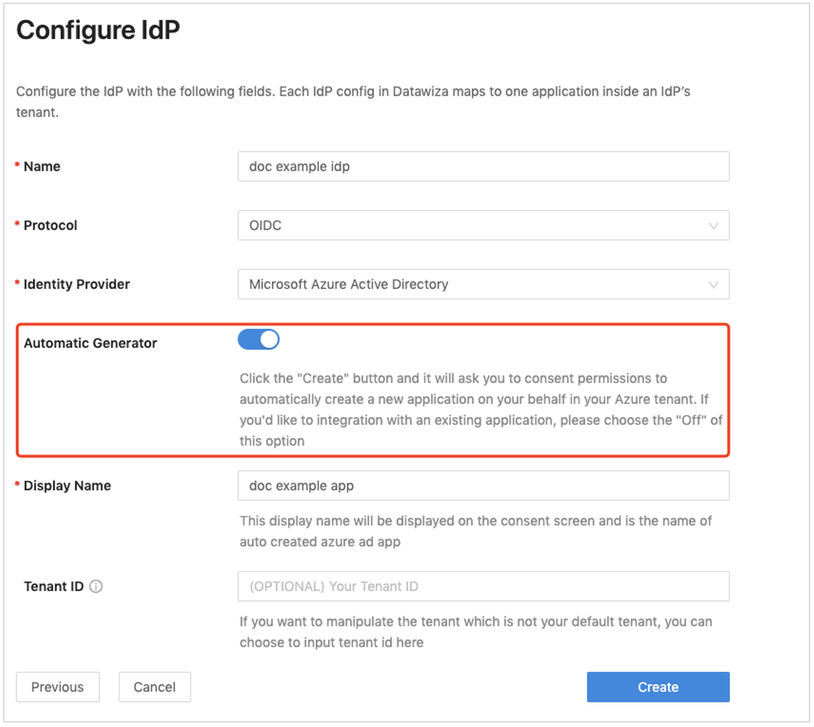

# Tutorial: Configure Secure Hybrid Access with Azure Active Directory and Datawiza

In this tutorial, learn how to integrate Azure Active Directory (Azure AD) with [Datawiza](https://www.datawiza.com/) for [hybrid access](../devices/concept-azure-ad-join-hybrid.md). [Datawiza Access Proxy (DAP)](https://www.datawiza.com) extends Azure AD to enable single sign-on (SSO) and provide access controls to protect on-premises and cloud-hosted applications, such as Oracle E-Business Suite, Microsoft IIS, and SAP. With this solution, enterprises can transition from legacy web access managers (WAMs), such as Symantec SiteMinder, NetIQ, Oracle, and IBM, to Azure AD without rewriting applications. Enterprises can use Datawiza as a no-code, or low-code, solution to integrate new applications to Azure AD. This approach enables enterprises to implement their Zero Trust strategy while saving engineering time and reducing costs.

Learn more: [Zero Trust security](../../security/fundamentals/zero-trust.md)

## Datawiza with Azure AD Authentication Architecture

Datawiza integration includes the following components:

* **[Azure AD](../fundamentals/active-directory-whatis.md)** - Identity and access management service that helps users sign in and access external and internal resources
* **Datawiza Access Proxy (DAP)** - This service transparently passes identity information to applications through HTTP headers
* **Datawiza Cloud Management Console (DCMC)** - UI and RESTful APIs for administrators to manage the DAP configuration and access control policies

The following diagram illustrates the authentication architecture with Datawiza in a hybrid environment.

   

1. The user requests access to the on-premises or cloud-hosted application. DAP proxies the request to the application.
2. DAP checks user authentication state. If there's no session token, or the session token is invalid, DAP sends the user request to Azure AD for authentication.
3. Azure AD sends the user request to the endpoint specified during DAP registration in the Azure AD tenant.
4. DAP evaluates policies and attribute values to be included in HTTP headers forwarded to the application. DAP might call out to the identity provider to retrieve the information to set the header values correctly. DAP sets the header values and sends the request to the application.
5. The user is authenticated and is granted access.

## Prerequisites

To get started, you need:

* An Azure subscription
  * If you don't have one, you can get an [Azure free account](https://azure.microsoft.com/free/)
* An [Azure AD tenant](../fundamentals/active-directory-access-create-new-tenant.md) linked to the Azure subscription
* [Docker](https://docs.docker.com/get-docker/) and [docker-compose](https://docs.docker.com/compose/install/) are required to run DAP
  * Your applications can run on platforms, such as a virtual machine (VM) or bare metal
* An on-premises or cloud-hosted application to transition from a legacy identity system to Azure AD
  * In this example, DAP is deployed on the same server as the application
  * The application runs on localhost: 3001. DAP proxies traffic to the application via localhost: 9772
  * The traffic to the application reaches DAP, and is proxied to the application

## Configure Datawiza Cloud Management Console

1. Sign in to [Datawiza Cloud Management Console](https://console.datawiza.com/) (DCMC).
2. Create an application on DCMC and generate a key pair for the app: `PROVISIONING_KEY` and `PROVISIONING_SECRET`. 
3. To create the app and generate the key pair, follow the instructions in [Datawiza Cloud Management Console](https://docs.datawiza.com/step-by-step/step2.html).
4. Register your application in Azure AD with [One Click Integration With Azure AD](https://docs.datawiza.com/tutorial/web-app-azure-one-click.html).

   

5. To use a web application, manually populate form fields: **Tenant ID**, **Client ID**, and **Client Secret**. 

   Learn more: To create a web application and obtain values, go to docs.datawiza.com for [Microsoft Azure AD](https://docs.datawiza.com/idp/azure.html) documentation.

   

6. Run DAP using either Docker or Kubernetes. The docker image is needed to create a sample header-based application.

  - For Kubernetes, see [Deploy Datawiza Access Proxy with a Web App using Kubernetes](https://docs.datawiza.com/tutorial/web-app-AKS.html)
  - For Docker, see [Deploy Datawiza Access Proxy With Your App](https://docs.datawiza.com/step-by-step/step3.html)
    - You can use the following sample docker image docker-compose.yml file:

   ```yaml
   services:
      datawiza-access-broker:
      image: registry.gitlab.com/datawiza/access-broker
      container_name: datawiza-access-broker
      restart: always
      ports:
      - "9772:9772"
      environment:
      PROVISIONING_KEY: #############################################
      PROVISIONING_SECRET: ##############################################
      
      header-based-app:
      image: registry.gitlab.com/datawiza/header-based-app
      restart: always
   ports:
   - "3001:3001"
   ```

7. Sign in to the container registry.
8. Download the DAP images and the header-based application in this [Important Step](https://docs.datawiza.com/step-by-step/step3.html#important-step).
9. Run the following command: `docker-compose -f docker-compose.yml up`.
10. The header-based application has SSO enabled with Azure AD.
11. In a browser, go to `http://localhost:9772/`. 
12. An Azure AD sign-in page appears.
13. Pass user attributes to the header-based application. DAP gets user attributes from Azure AD and passes attributes to the application via a header or cookie. 
14. To pass user attributes such as email address, first name, and last name to the header-based application, see [Pass User Attributes](https://docs.datawiza.com/step-by-step/step4.html).
15. To confirm configured user attributes, observe a green check mark next to each attribute.

   

## Test the flow

1. Go to the application URL. 
2. DAP redirects you to the Azure AD sign-in page.
3. After authentication, you're redirected to DAP.
4. DAP evaluates policies, calculates headers, and sends you to the application. 
5. The requested application appears.

## Next steps

* [Tutorial: Configure Azure Active Directory B2C with Datawiza to provide secure hybrid access](../../active-directory-b2c/partner-datawiza.md)
* [Tutorial: Configure Datawiza to enable Azure AD MFA and SSO to Oracle JD Edwards](datawiza-sso-oracle-jde.md)
* [Tutorial: Configure Datawiza to enable Azure AD MFA and SSO to Oracle PeopleSoft](datawiza-azure-ad-sso-oracle-peoplesoft.md)
* Go to docs.datawiza.com for Datawiza [User Guides](https://docs.datawiza.com)
