# Tutorial: Migrate Okta sync provisioning to Azure AD Connect synchronization 

In this tutorial, learn to migrate user provisioning from Okta to Azure Active Directory (Azure AD) and migrate User Sync or Universal Sync to Azure AD Connect. This capability enables provisioning into Azure AD and Office 365.

   > [!NOTE]
   > When migrating synchronization platforms, validate steps in this article against your environment before you remove Azure AD Connect from staging mode or enable the Azure AD cloud provisioning agent.

## Prerequisites

When you switch from Okta provisioning to Azure AD, there are two choices. Use an Azure AD Connect server or Azure AD cloud provisioning. 

Learn more: [Comparison between Azure AD Connect and cloud sync](../cloud-sync/what-is-cloud-sync.md#comparison-between-azure-ad-connect-and-cloud-sync).

Azure AD cloud provisioning is the most familiar migration path for Okta customers who use Universal Sync or User Sync. The cloud provisioning agents are lightweight. You can install them on, or near, domain controllers like the Okta directory sync agents. Don't install them on the same server.

When you synchronize users, use an Azure AD Connect server if your organization needs any of the following technologies:

- Device synchronization: Hybrid Azure AD join or Hello for Business
- Pass-through authentication
- Support for more than 150,000 objects
- Support for writeback

  >[!NOTE]
  >Take all prerequisites into consideration when you install Azure AD Connect or Azure AD cloud provisioning. Before you continue with installation, see [Prerequisites for Azure AD Connect](../hybrid/how-to-connect-install-prerequisites.md).

## Confirm ImmutableID attribute synchronized by Okta

The ImmutableID attribute ties synchronized objects to their on-premises counterparts. Okta takes the Active Directory objectGUID of an on-premises object and converts it to a Base64-encoded string. By default, it then stamps that string to the ImmutableID field in Azure AD.

You can connect to Microsoft Graph PowerShell and examine the current ImmutableID value. If you've never used the Microsoft Graph PowerShell module, run
`Install-Module AzureAD` in an administrative session before you run the following commands:

```Powershell
Import-module AzureAD
Connect-MgGraph
```

If you have the module, a warning might appear to update to the latest version.

1. Import the module after it's installed.
2. In the authentication window, enter Global Administrator credentials.

   

3. Connect to the tenant.
4. Verify ImmutableID value settings. The following example is the default of converting the objectGUID into the ImmutableID.

   


5. Manually confirm the conversion from objectGUID to Base64 on-premises. To test an individual value, use these commands:

   ```PowerShell
   Get-MgUser onpremupn | fl objectguid
   $objectguid = 'your-guid-here-1010'
   [system.convert]::ToBase64String(([GUID]$objectGUID).ToByteArray())
   ```

   

## ObjectGUID mass-validation methods

Before you move to Azure AD Connect, it's critical to validate that the ImmutableID values in Azure AD match their on-premises values.

The following command gets on-premises Azure AD users and exports a list of their objectGUID values and ImmutableID values already calculated to a CSV file.

1. Run this command in Microsoft Graph PowerShell on an on-premises domain controller:


   ```PowerShell
   Get-MgUser -Filter * -Properties objectGUID | Select-Object
   UserPrincipalName, Name, objectGUID, @{Name = 'ImmutableID';
   Expression = {
   [system.convert]::ToBase64String((GUID).tobytearray())
   } } | export-csv C:\Temp\OnPremIDs.csv
   ```

   

1. Run this command in a Microsoft Graph PowerShell session to list the synchronized values:


   ```powershell
   Get-MgUser -all $true | Where-Object {$_.dirsyncenabled -like
   "true"} | Select-Object UserPrincipalName, @{Name = 'objectGUID';
   Expression = {
   [GUID][System.Convert]::FromBase64String($_.ImmutableID) } },
   ImmutableID | export-csv C:\\temp\\AzureADSyncedIDS.csv
   ```

   

3. After both exports, confirm user ImmutableID values match.

   >[!IMPORTANT]
   >If your ImmutableID values in the cloud don't match objectGUID values, you've modified the defaults for Okta sync. You've likely chosen another attribute to determine ImmutableID values. Before going the next section, identify which source attribute populates ImmutableID values. Before you disable Okta sync, update the attribute Okta is syncing.

## Install Azure AD Connect in staging mode

After you prepare your list of source and destination targets, install an Azure AD Connect server. If you use Azure AD Connect cloud provisioning, skip this section.

1. Download and install Azure AD Connect on a server. See, [Custom installation of Azure Active Directory Connect](../hybrid/how-to-connect-install-custom.md).
2. In the left panel, select **Identifying users**.
3. On the **Uniquely identifying your users** page, under **Select how users should be identified with Azure AD**, select **Choose a specific attribute**. 
4. If you haven't modified the Okta default, select **mS-DS-ConsistencyGUID**.

   >[!WARNING]
   >This step is critical. Ensure the attribute you select for a source anchor currently populates your Azure AD users. If you select the wrong attribute, uninstall and reinstall Azure AD Connect to reselect this option.
   
   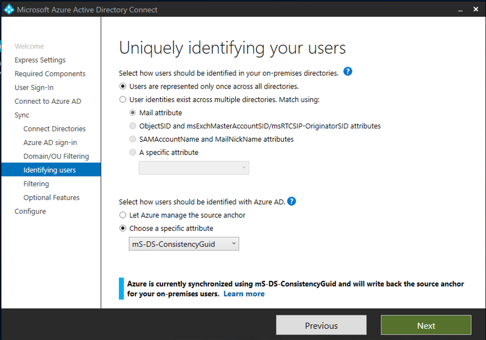

5. Select **Next**.
6. In the left panel, select **Configure**.
7. On the **Ready to configure** page, select **Enable staging mode**. 
8. Select **Install**.

   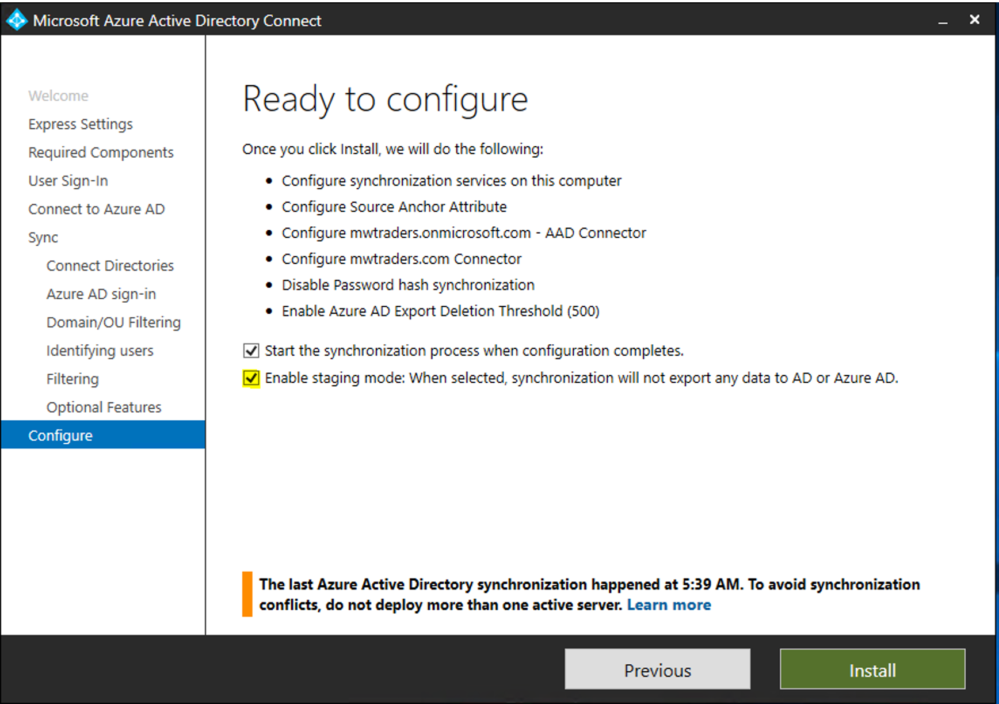

9. Verify the ImmutableID values match.
10. When the configuration is complete, select **Exit**.
11. Open **Synchronization Service** as an administrator.

   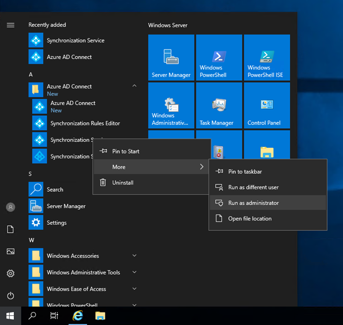

12. Find the **Full Synchronization** to the domain.onmicrosoft.com connector space. 
13. Confirm there are users under the **Connectors with Flow Updates** tab.

   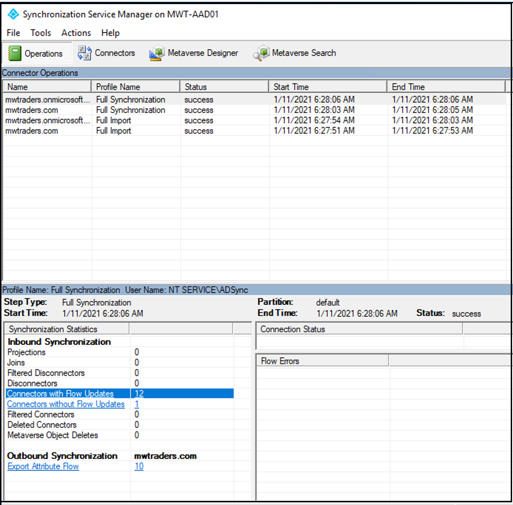

14. Verify no pending deletions in the export. 
15. Select the **Connectors** tab.
16. Highlight the domain.onmicrosoft.com connector space. 
17. Select **Search Connector Space**.

   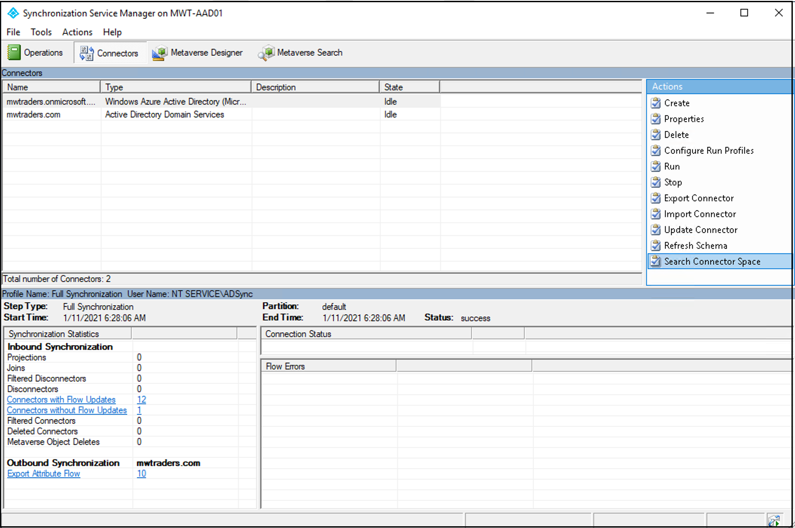

18. In the **Search Connector Space** dialog, under **Scope**, select **Pending Export**.

   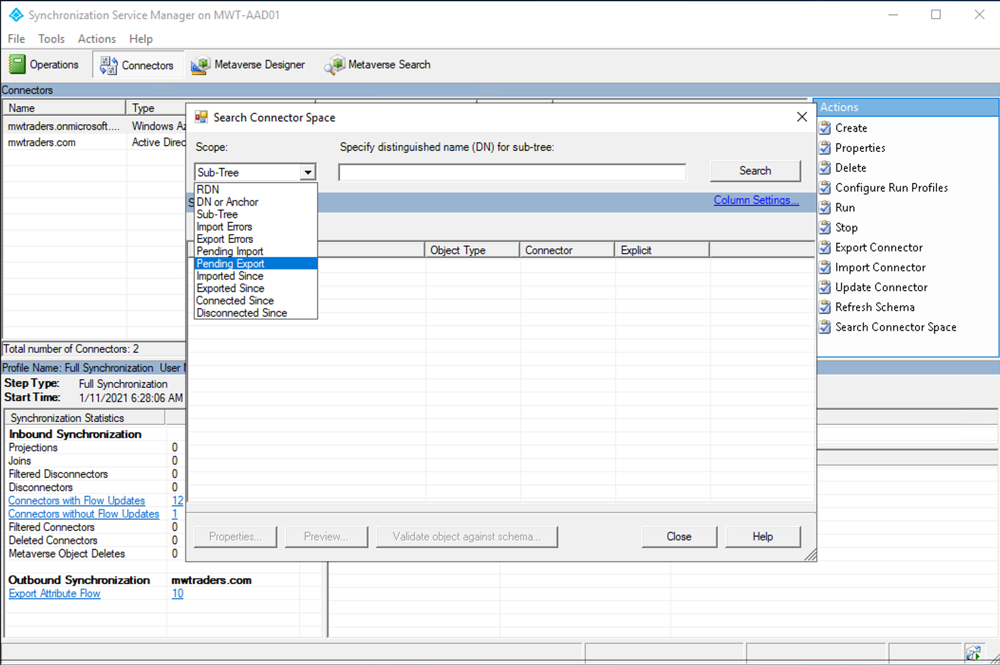

19. Select **Delete**.
20. Select **Search**. If all objects match, no matching records appear for **Deletes**. 
21. Record objects pending deletion and their on-premises values.

   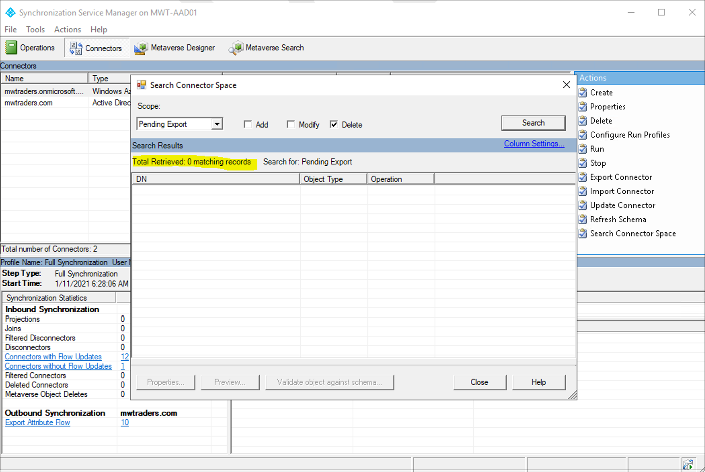

22. Clear **Delete**.
23. Select **Add**.
24. Select **Modify**. 
25. Select **Search**. 
26. Update functions appear for users being synchronized to Azure AD via Okta. Add new objects Okta isn't syncing, which are in the organizational unit (OU) structure selected during Azure AD Connect installation.

   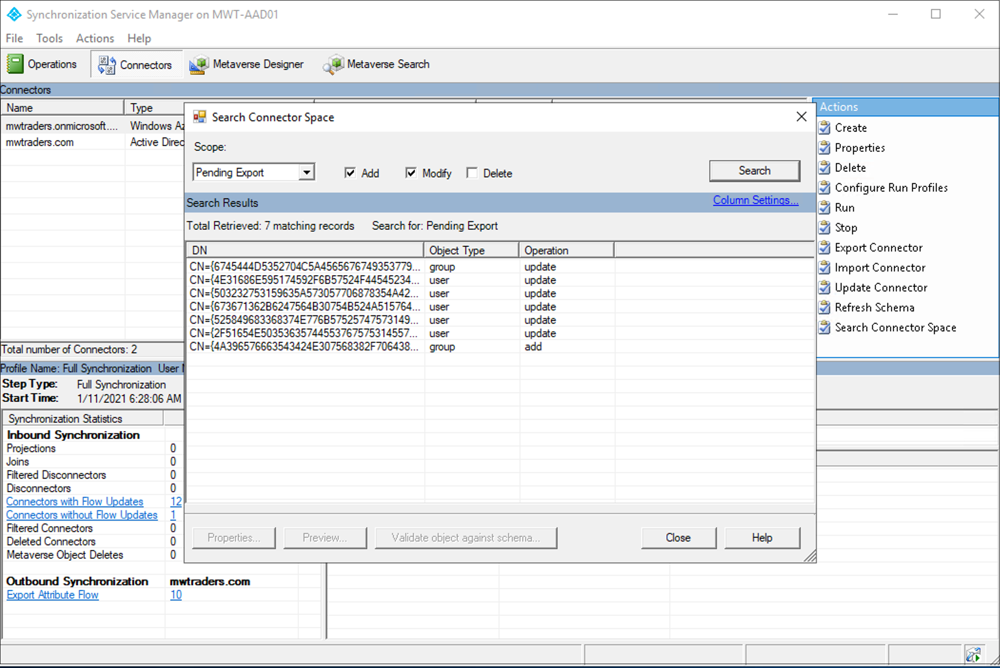

27. To see what Azure AD Connect communicates with Azure AD, double-click an update.

   > [!NOTE]
  > If there are **add** functions for a user in Azure AD, their on-premises account doesn't match the cloud account. AD Connect creates a new object and records new and unexpected adds. 

28. Before you exit the staging mode, correct the ImmutableID value in Azure AD.

In this example, Okta stamped the **mail** attribute to the user's account, although the on-premises value wasn't accurate. When Azure AD Connect takes over the account, the **mail** attribute is deleted from the object.

29. Verify updates include attributes expected in Azure AD. If multiple attributes are being deleted, you can populate on-premises AD values before you remove the staging mode.

   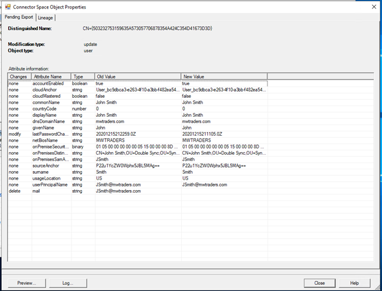

   >[!NOTE]
   >Before you continue, ensure user attributes are syncing and appear on the **Pending Export** tab. If they're deleted, ensure the ImmutableID values match and the user is in a selected OU for synchronization.

## Install Azure AD cloud sync agents

After you prepare your list of source and destination targets, install and configure Azure AD cloud sync agents. See, [Tutorial: Integrate a single forest with a single Azure AD tenant](../cloud-sync/tutorial-single-forest.md). 

   > [!NOTE]
   > If you use an Azure AD Connect server, skip this section.

## Disable Okta provisioning to Azure AD

After you verify the Azure AD Connect installation, disable Okta provisioning to Azure AD.

1. Go to the Okta portal
2. Select **Applications**.
3. Select the Okta app that provisions users to Azure AD. 
4. Select the **Provisioning** tab.
5. Select the **Integration** section.

   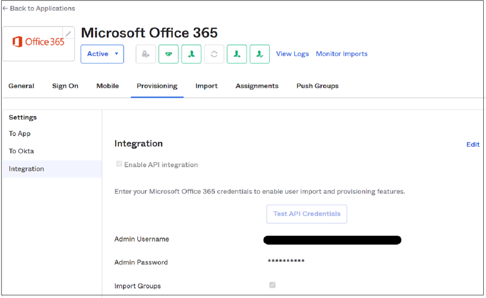

6. Select **Edit**.
7. Clear the **Enable API integration** option.
8. Select **Save**.

   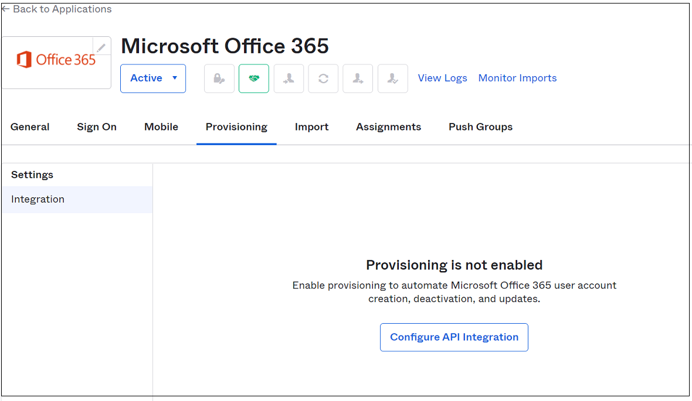

   >[!NOTE]
   >If you have multiple Office 365 apps that handle provisioning to Azure AD, ensure they switched off.

## Disable staging mode in Azure AD Connect

After you disable Okta provisioning, the Azure AD Connect server can synchronize objects. 

   >[!NOTE]
   >If you use Azure AD cloud sync agents, skip this section.

1. From the desktop, run the installation wizard from the desktop.
2. Select **Configure**.

   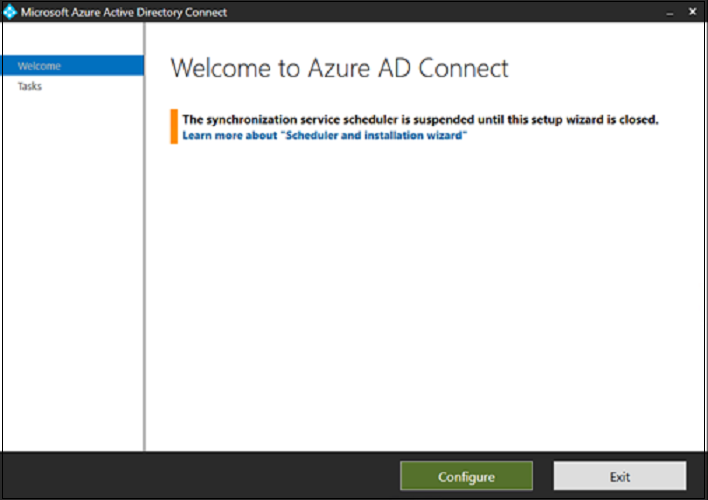

3. Select **Configure staging mode** 
4. Select **Next**. 
5. Enter Global Administrator credentials.

   

6. Clear **Enable staging mode**.
7. Select **Next**.

   

8. Select **Configure**.

   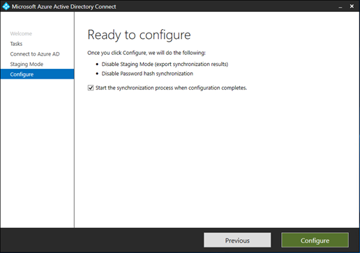

9. After configuration, open the **Synchronization Service** as an administrator. 
10. On the domain.onmicrosoft.com connector, view the **Export**. 
11. Verify additions, updates, and deletions.

   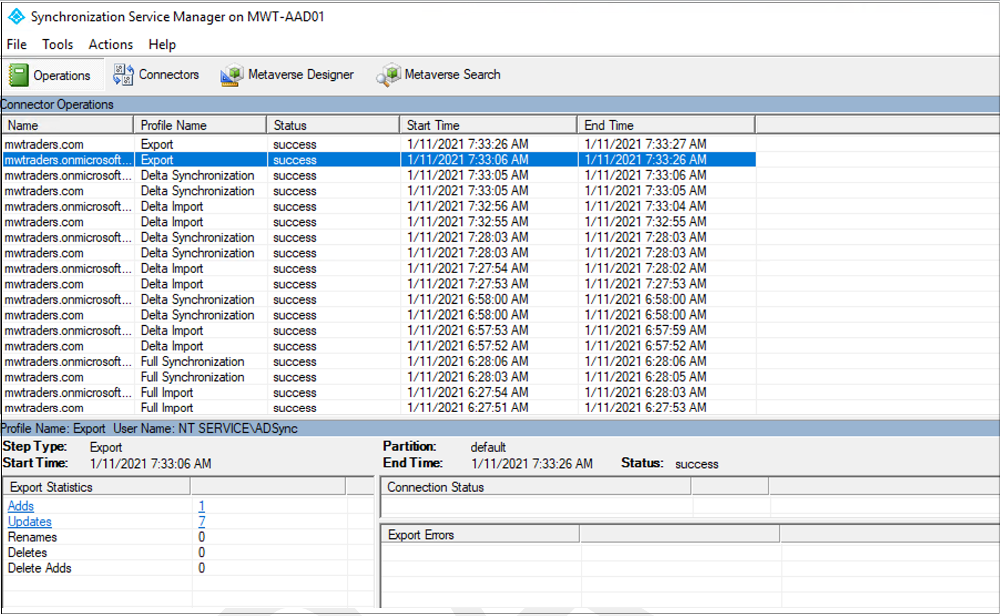

12. Migration is complete. Rerun the installation wizard to update and expand Azure AD Connect features.

## Enable cloud sync agents

After you disable Okta provisioning, the Azure AD cloud sync agent can synchronize objects.

1. Go to the [Azure portal](https://portal.azure.com/).
2. Browse to **Azure Active Directory**.
3. Select **Azure AD Connect**.
4. Select **Cloud Sync**.
5. Select **Configuration** profile
6. Select **Enable**.
7. Return to the provisioning menu and select **Logs**.
8. Confirm the provisioning connector updated in-place objects. The cloud sync agents are nondestructive. Updates fail if a match isn't found.
9. If a user is mismatched, make updates to bind the ImmutableID values. 
10. Restart the cloud provisioning sync.

## Next steps

- [Tutorial: Migrate your applications from Okta to Azure AD](migrate-applications-from-okta.md)
- [Tutorial: Migrate Okta federation to Azure AD-managed authentication](migrate-okta-federation.md)
- [Tutorial: Migrate Okta sign-on policies to Azure AD Conditional Access](migrate-okta-sign-on-policies-to-azure-active-directory-conditional-access.md)
